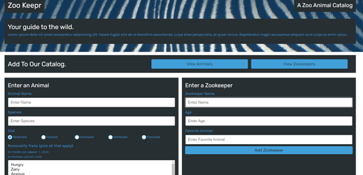
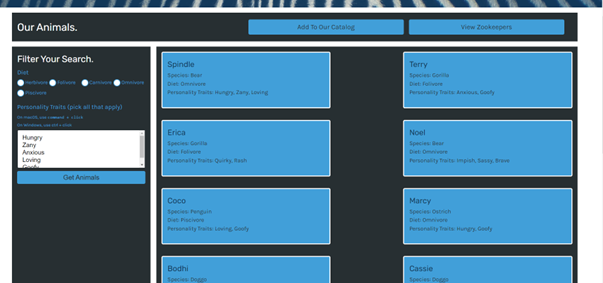
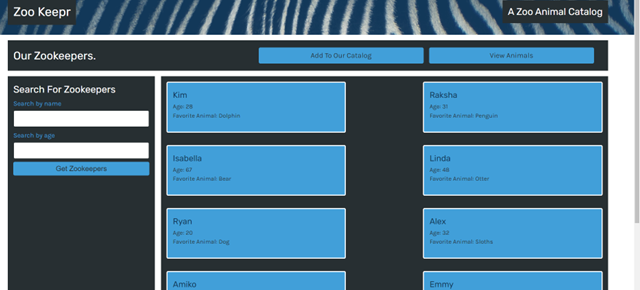

# zookeepr

## Description
  Zookeepr, utilizes a web server using Express.js that is added to a front-end. The information lives on the server allowing anyone to access it from different locations and browsers. For deployment the zookeepr application utlizes Heroku, for testing, Insomnia.

## Table of Contents 
  * [Installation](#installation)
  * [Usage](#usage)
  * [Important-Links](#Important-Links)
  * [Questions](#questions)

  ## Installation
  * Ensure you are in your root folder,then open terminal and clone code from github. Then run these in the command terminal:

  * Next, run "npm init -y" to install packages 
  * Jest Setup - "npm i jest" > 
  * Express > "npm i express" 

   ## Usage 
  Used to a note taker for the end-user. 
  * Firstly, open the terminal 
  
  * To test the functions "npm run test"
  * Then to run the application in terminal use: "node server" and navigate to the web browser and use `localhost:3001` to access the site
  * Or you can deploy and run with heroku: https://zookeepr20.herokuapp.com/
  

   

   
 
   

 ## Important Links 
* GitHub Link: https://github.com/MichaelZimm20/zookeepr
* Heroku Link: https://zookeepr20.herokuapp.com/

## Questions 
  If you have any questions or concerns, contact:
  * GitHub: [MichaelZimm20](https://github.com/MichaelZimm20)